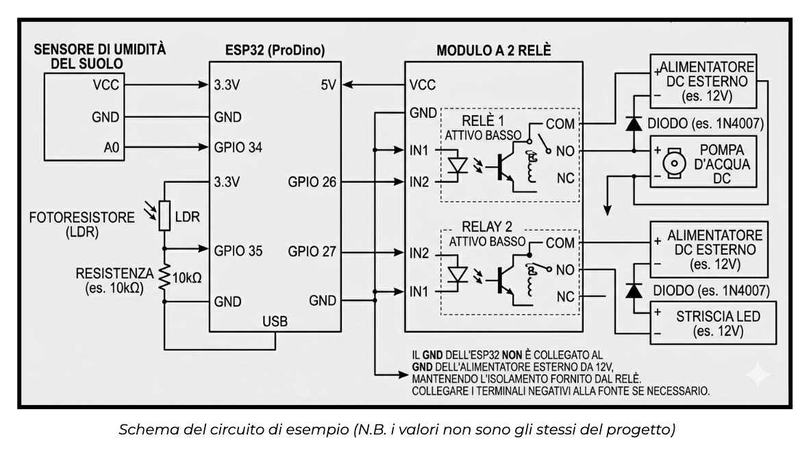
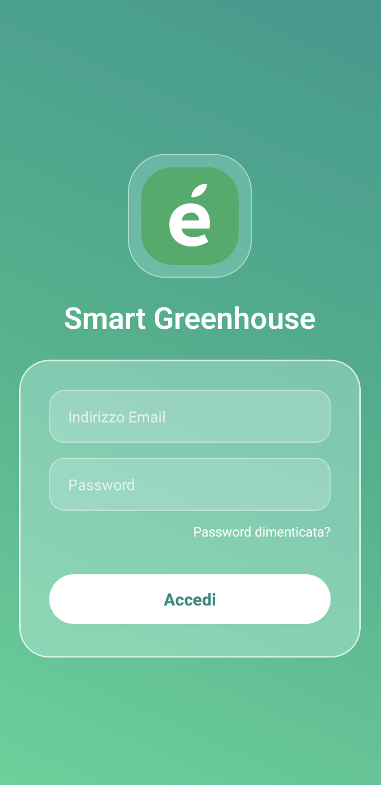
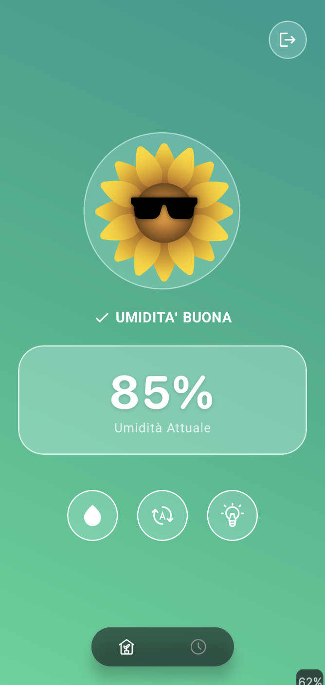
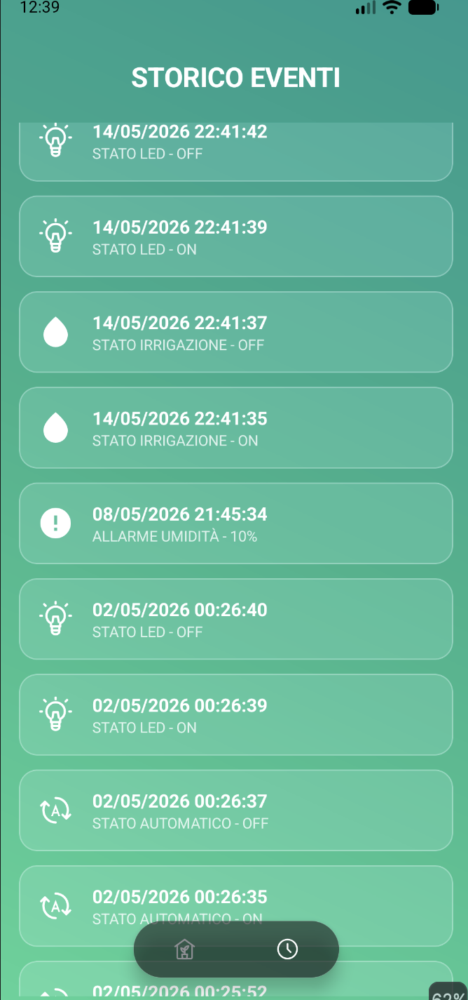

> Sviluppo di un progetto IoT collegato ad applicazione Android tramite Firebase Realtime Database

---

### Descrizione del Progetto

**My Greénhouse** è un sistema IoT per il monitoraggio e il controllo automatico di una serra intelligente.  
L'utente può controllare in tempo reale l'umidità del terreno, lo stato della pompa e l'illuminazione LED direttamente dal proprio smartphone Android, oppure affidarsi alla modalità automatica che gestisce tutto in autonomia tramite un server remoto.

---
### Architettura del Sistema

```
                [ProDino ESP32]
                     Serra
                       |
                       | (WiFi)
                       ↓
           Firebase Realtime Database
                       |
       ├──────────────────────────────|
       ↓                              ↓
[App Android]                     [Node.js]
 Dashboard UI                Logica Automatica + 
                                Notifiche Push
```

Il sistema è composto da tre componenti principali che comunicano tra loro tramite Firebase:
1. **Firmware ProDino ESP32** — legge i sensori e comanda i relè (pompa e LED).
2. **Applicazione Android** — pannello di controllo per l'utente.
3. **Server Node.js** — cervello dell'automazione e motore delle notifiche push.

---

### Funzionalità

####  Modalità Automatica
- Attivazione automatica della **pompa** quando l'umidità scende sotto il **35%**
- Spegnimento automatico quando l'umidità risale all'**70%**
- Accensione automatica delle **luci LED** quando il sensore rileva il buio
- Invio di **notifica push** di emergenza se l'umidità scende sotto il **30%**
- Registrazione di tutti gli eventi automatici nello **Storico**

#### Modalità Manuale (App Android)
- Visualizzazione in tempo reale della percentuale di **umidità del terreno**
- Controllo manuale di **pompa**, **luci LED** e **modalità automatica**
- **Storico** degli ultimi 250 eventi (irrigazioni, accensioni, allarmi)
- **Mascotte animata** che cambia espressione in base allo stato della serra
- **Autenticazione** sicura con Firebase Auth

---

### Stack Tecnologico

| Layer | Tecnologia               |
|---|--------------------------|
| Microcontrollore | ESP32 (ProDino ESP32)    |
| Firmware | C++ — Arduino IDE        |
| Database | Firebase Realtime Database |
| Autenticazione | Firebase Authentication  |
| Notifiche Push | Firebase Cloud Messaging |
| App Mobile | Android (Java) — Android Studio |
| Server Backend | Node.js —  Render        |

---

### Hardware

| Componente | Descrizione |
|---|---|
| ESP32 (ProDino) | Microcontrollore principale con WiFi integrato |
| Sensore Umidità | Sensore capacitivo per il terreno |
| Sensore Luminosità | Fotoresistore|
| Pompa Irrigazione | Pompa 5V controllata tramite relè |
| Striscia LED | Luci coltivazione 12V controllate tramite relè |

### Schema di Collegamento



---

### Struttura del Database Firebase

```
smartgreenhouse-e3a04-default-rtdb
│
├── auto_status: true / false
│
├── umidita
│   ├── sensore: 65           ← percentuale di umidità (inviata dall'ESP32)
│   └── pompa_status: "ON" / "OFF"
│
├── luci
│   ├── led_status: "ON" / "OFF"
│   └── buio_status: true / false   ← inviato dall'ESP32
│
└── eventi
    └── [id_evento]
        ├── tipoEvento: "IRRIGAZIONE" / "LUCI" / "AUTO" / "ALLARME"
        ├── stato: "ON" / "OFF" / "[percentuale]"
        └── timestamp: "22/05/2025 19:30:00"
```

---

### Struttura del Repository

```
My-Greenhouse/
│
├── app/                                # Applicazione Android
│   └── src/main/java/.../
│       ├── MainActivity.java           # Dashboard principale
│       ├── LoginActivity.java          # Schermata di login
│       ├── StoricoActivity.java        # Storico degli eventi
│       ├── LogAdapter.java             # Adapter RecyclerView storico
│       ├── LogEvento.java              # Modello dati evento
│       └── Funzione.java               # Enum tipi di funzione
│
└── README.md

```

---

### Installazione e Configurazione

#### 1. Firebase
1. Creare un progetto su [Firebase Console](https://console.firebase.google.com)
2. Abilitare **Realtime Database**, **Authentication** e **Cloud Messaging**
3. Scaricare il file `google-services.json` e inserirlo nella cartella `app/`
4. Verificare che nel file sia presente il campo `database_url`

#### 2. App Android
1. Aprire il progetto con **Android Studio**
2. Inserire il file `google-services.json` in `app/`
3. Eseguire il build e installare l'APK sul dispositivo
---

### Screenshot dell'Applicazione

| Login | Dashboard | Storico |
|----------------------------------|---|---|
|  |  |  |

---

### Autori

| Nome | Classe   | Istituto |
|---|----------|----------|
| Claudio Carminati | 4C - ITT|C. Marzoli|
| Andrea Pedrali | 4C - ITT |C. Marzoli|
| Andrea Rota | 4C - ITT |C. Marzoli|
| Filippo Vezzoli |4C - ITT|C. Marzoli|


---

### Licenza
Questo progetto è stato realizzato a scopo didattico nell'ambito del percorso scolastico.  
